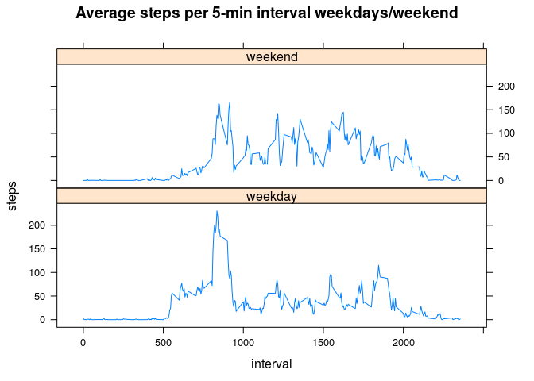

# Reproducible Research: Assessment 1


## Loading and preprocessing the data

### 1. Load the data

Use unzip to unzip file, then read.csv to read data


```r
unzip("activity.zip")
activity <- read.csv(file = "activity.csv",stringsAsFactors=FALSE)
str(activity)
```

```
## 'data.frame':	17568 obs. of  3 variables:
##  $ steps   : int  NA NA NA NA NA NA NA NA NA NA ...
##  $ date    : chr  "2012-10-01" "2012-10-01" "2012-10-01" "2012-10-01" ...
##  $ interval: int  0 5 10 15 20 25 30 35 40 45 ...
```

### 2. Process/transform the data (if necessary) into a format suitable for your analysis

As far as I can see at the moment, the data is already in a suitable format.


## What is mean total number of steps taken per day?

For this part of the assignment, ignore the missing values.

### 1. Make a histogram of the total number of steps taken each day


```r
steps_per_day <- tapply(activity$steps, activity$date, sum)
hist(steps_per_day,breaks = 10,main="Steps taken per day", xlab="Steps per day")
```

 

### 2. Calculate and report the mean and median total number of steps taken per day

Mean:


```r
mean(steps_per_day,na.rm=TRUE)
```

```
## [1] 10766.19
```

Median:


```r
median(steps_per_day,na.rm=TRUE)
```

```
## [1] 10765
```


## What is the average daily activity pattern?

### 1. Time series plot

*Make a time series plot (i.e. type = "l") of the 5-minute interval (x-axis) and the average number of steps taken, averaged across all days (y-axis).*


```r
interval_steps <- aggregate(steps ~ interval, data=activity, FUN=mean, na.rm=TRUE)
plot(interval_steps,type='l',xlab='interval',main="Average steps per 5-min interval throughout the day")
```

 

### 2. Most active interval

*Which 5-minute interval, on average across all the days in the dataset, contains the maximum number of steps?*


```r
maxSteps=max(interval_steps$steps)
maxInt=interval_steps$interval[interval_steps$steps==maxSteps]
```

The most active 5-minute-interval is 835, with an average of 206.1698113 steps taken.

## Imputing missing values
*Note that there are a number of days/intervals where there are missing values (coded as NA). The presence of missing days may introduce bias into some calculations or summaries of the data.*

### 1. Total number of missing values

*Calculate and report the total number of missing values in the dataset (i.e. the total number of rows with NAs)*


```r
sum(is.na(activity$steps))
```

```
## [1] 2304
```

### 2. Missing values strategy 
*Devise a strategy for filling in all of the missing values in the dataset.*

If a missing value is found, fill in mean for that 5-minute interval. (Expect this to be the reasonably accurate, because number of steps taken varies according to time of days, yet we would expect it to be pretty consistent across days.)


### 3. New dataset with missing values filled in
*Create a new dataset that is equal to the original dataset but with the missing data filled in.*


```r
newActivity <- activity
for (i in 1:nrow(activity))
{
    if (is.na(activity$steps[i]))
    {
        naInterval=activity$interval[i]
        newActivity$steps[i] <- interval_steps$steps[interval_steps$interval==naInterval]            
    }
}
# test that this went to plan. 
head(newActivity)
```

```
##       steps       date interval
## 1 1.7169811 2012-10-01        0
## 2 0.3396226 2012-10-01        5
## 3 0.1320755 2012-10-01       10
## 4 0.1509434 2012-10-01       15
## 5 0.0754717 2012-10-01       20
## 6 2.0943396 2012-10-01       25
```

```r
# There should be no more missing values in the new dataset
sum(is.na(newActivity$steps))
```

```
## [1] 0
```

### 4. Impact of imputing missing data
*Make a histogram of the total number of steps taken each day and Calculate and report the mean and median total number of steps taken per day. Do these values differ from the estimates from the first part of the assignment? What is the impact of imputing missing data on the estimates of the total daily number of steps?*


```r
new_steps_per_day <- tapply(newActivity$steps, newActivity$date, sum)
hist(new_steps_per_day,breaks = 10,main="Steps taken per day", xlab="Steps per day")
```

 

The shape of the histogram is similar, but because we have more days for which data exist, we have higher peaks.

Mean:


```r
mean(new_steps_per_day,na.rm=TRUE)
```

```
## [1] 10766.19
```

Because all we have done is replace missing values with means, the overall mean does not change.

Median:


```r
median(new_steps_per_day,na.rm=TRUE)
```

```
## [1] 10766.19
```

Because we have replaced missing values with means, the median has shifted a little bit and now coincides with the mean.


## Are there differences in activity patterns between weekdays and weekends?

*For this part the weekdays() function may be of some help here. Use the dataset with the filled-in missing values for this part.*

### 1. Weekday v weekend 

*Create a new factor variable in the dataset with two levels – “weekday” and “weekend” indicating whether a given date is a weekday or weekend day.*


```r
weekend = c('Saturday','Sunday')
newActivity$day <- ifelse(weekdays(as.POSIXct(newActivity$date)) %in% weekend, "weekend", "weekday")
head(newActivity)                                                                              
```

```
##       steps       date interval     day
## 1 1.7169811 2012-10-01        0 weekday
## 2 0.3396226 2012-10-01        5 weekday
## 3 0.1320755 2012-10-01       10 weekday
## 4 0.1509434 2012-10-01       15 weekday
## 5 0.0754717 2012-10-01       20 weekday
## 6 2.0943396 2012-10-01       25 weekday
```

```r
newActivity[1800:1806,]
```

```
##      steps       date interval     day
## 1800     0 2012-10-07      555 weekend
## 1801     0 2012-10-07      600 weekend
## 1802     0 2012-10-07      605 weekend
## 1803     0 2012-10-07      610 weekend
## 1804    34 2012-10-07      615 weekend
## 1805    13 2012-10-07      620 weekend
## 1806     7 2012-10-07      625 weekend
```


### 2. Panel plot

*Make a panel plot containing a time series plot (i.e. type = "l") of the 5-minute interval (x-axis) and the average number of steps taken, averaged across all weekday days or weekend days (y-axis).*


```r
new_interval_steps <- aggregate(steps ~ interval + day, data=newActivity, FUN=mean, na.rm=TRUE)
library(lattice)
xyplot(steps~interval|day,data=new_interval_steps,type='l',xlab='interval',main="Average steps per 5-min interval weekdays/weekend",layout=c(1,2))
```

 

On weekdays, there is a noticeable peak in the morning (presumably when the person goes to work). On weekends, walking activity is more evenly distributed throughout the day (and starts a little later).


